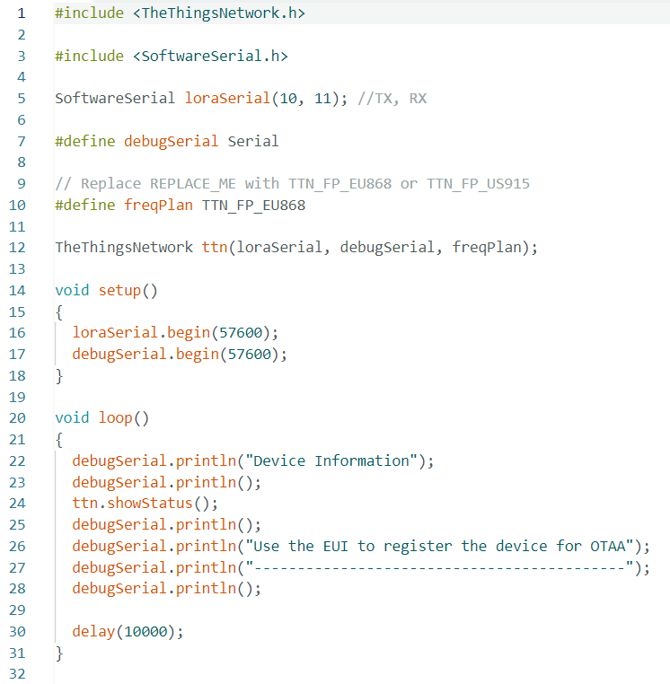

# Sensor Gas Project by Alexis PAYET & Benjamin ABONNEAU

## Introduction

These days, the Internet of Things is becoming more and more prevalent, which is why it's interesting to look at how an object (a sensor, for example) is implemented from its creation to its deployment.

This is what the UF Smart Devices enabled us to do this year with a gas sensor. Starting with its manufacture during an internship at AIME, then tackling its schematic design and ending with its use and analysis.

In what follows, we'll look at the various stages we covered throughout the process.


## I. Manufacture of the gas sensor

During a week-long internship at AIME, we designed a gas sensor. Using various chemical processes, we were able to design nano-particles that we deposited on our sensor with the aim of making it intelligent. In order to design these nano-particles we followed a protocol that indicated a series of steps to be carried out, for example mixing different chemical substances together or simply cooking them at very high temperatures for a few minutes.


## II. Initial wiring

A few weeks later, having completed the design of our gas sensor, we were able to embark on the second stage of the project. The first stage involved wiring up the various components supplied. The aim was then to connect a gas sensor, retrieve its value using a program, send this value over a LoRaWAN network and finally retrieve it from an online application that would analyse it.

We used :
- An MQ-2 Grove gas sensor from Seeed
- An Arduino board to link all the components together and retrieve the sensor data via a mini program
- A board fitted with an RN2483A microchip for sending data over the LoRa network

Before starting the wiring, we had to do some soldering on the LoRa board. The board wasn't yet attached to the microchip, so it had to be soldered. We only soldered the pins we were interested in, namely : TX, RX, RST, 3V3 and GND. This allows us to power our chip and also send and receive data.

For the wiring, we chose to connect the gas sensor to pin A0 on the Arduino board and TX and RX on the LoRa board are connected to pin 10 and 11 respectively on the Arduino board. To power everything, we supply the Arduino board via the computer's USB port.

<div align="center">
<br />
<p>Photo of the wiring</p>
</div>


## III. Arduino program

Now that we had our wiring done, we had to ensure that we could retrieve the sensor data using a program.

To do this, we used two different Arduino programs. The first, DeviceInfo, enabled us to retrieve the information from our LoRa board so that we could register it on the LoRaWAN gateway and create our LoRa application.

<div align="center">
<br />
<p>DeviceInfo program</p>
</div>

Example of information retrieved with the program :
```
Device Information

EUI: 0004A30B00F49C7E
Battery: 3480
AppEUI: 0000000000000000
DevEUI: 0004A30B00F49C7E
Data Rate: 0
RX Delay 1: 1000
RX Delay 2: 2000

Use the EUI to register the device for OTAA
-------------------------------------------
```

The second Send program sends the data from the gas sensor to our LoRa network.

We had to configure a few lines to make the code work: the appEui and appKey fields, the TX and RX pins (corresponding to pins 10 and 11 as we saw earlier), and the GAZ_SENSOR_PIN pin corresponding to A0 and used to read the data output by the gas sensor. Once the configuration was complete, all that remained was to send the data using the sendBytes() function, which takes as its arguments a message to be sent (in our case the value of the gas sensor) and the size of the message (set to 2 because it is a two-digit value).

<div align="center">
<br />
<br />
<p>Send program</p>
</div>


## IV. NodeRED

Once the wiring had been done and our data sent to the LoRa network, we had to retrieve the message. To do this we used NodeRED, which is a very easy-to-use tool that makes it fairly simple to create applications. It comes in the form of blocks that can be attached to each other, allowing you to build your application as you go along. Each block corresponds to a function. Here we've used an MQTT block to listen for new incoming messages. Each time a message arrives (i.e. a new value from the gas sensor), we perform the various functions defined in NodeRED. In our case, we simply decode the message to make it clear so that we can display it in our application.

<div align="center">
<br />
<p>Representation of the NodeRED program</p>
</div>


## V. Drawing the schematic

Now that we know that our LoRa network works, we wanted to take it a step further by making our own board to use on our own gas sensor. First we had to create the schematic. This was done by making different blocks. We found the elements we had seen previously, such as the Arduino, the LoRa board and the gas sensor, but also new components such as the amplifier and the potentiometer, which will enable us to amplify the signal because the signal supplied by the Arduino's ADC is too weak. There's also a switch that lets you choose the gas sensor you want from the two available.


<div align="center">
<br />
<p>Global representation of the schematic</p>
</div><br />

<div align="center">
<br />
<p>Gas sensor diagram</p>
</div><br />

<div align="center">
<br />
<p>Switch diagram</p>
</div><br />

<div align="center">
<br />
<p>Amplifier diagram</p>
</div><br />

<div align="center">
<br />
<p>Potentiometer diagram</p>
</div><br />

<div align="center">
<br />
<p>LoRa board diagram</p>
</div>


## VI. Designing the PCB

Once the wiring diagram was finished, all that remained was to place the components on the board and connect them together. The most difficult step was to think about how to arrange the components on the PCB, as the wires can't cross each other.

<div align="center">
<br />
<p>PCB representation in the editor</p>
</div><br />

<div align="center">
<br />
<br />
<p>PCB representation in 3D view</p>
</div>


## Future Work

Unfortunately we haven't had time to print our PCB, so the first thing to do would be to print it out and then carry out a few tests to make sure it works. Also, our NodeRED application isn't super-developed and a graphical interface to be able to detect a gas change might be interesting to implement.


## Conclusion

This project has enabled us to develop our technical skills in different areas while learning new ones. For example, the KiCad software is one of the things we'd never used before and it was interesting to discover how you can make fairly simplistic maps once you've mastered it.